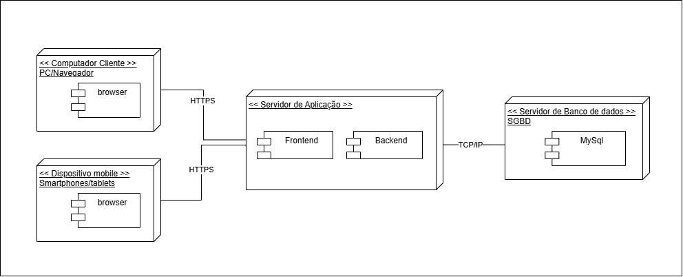

# Diagrama de Implantação

## Participantes

| Nome                      |
|---------------------------|
| [Breno Fernandes](https://github.com/brenofrds) |
| [Bruno Ricardo](https://github.com/EhOBruno)   |
| [Mayara Alves de Oliveira](https://github.com/mayara-tech) | 
| [Bruno de Oliveira](https://github.com/BrunoOLiveirax) |

## Introdução

O Diagrama de Implementação é uma ferramenta da UML (Unified Modeling Language) utilizada para representar a arquitetura física do sistema, mostrando como os componentes de software são distribuídos em diferentes nós da infraestrutura. Ele ilustra os dispositivos e servidores envolvidos, as conexões entre eles e os componentes de software implantados em cada ambiente.

Esse tipo de diagrama permite visualizar a estrutura física do sistema, facilitando o entendimento da distribuição, comunicação e integração entre os diferentes elementos que compõem a solução.

## Objetivo

O objetivo do Diagrama de Implementação é apresentar a arquitetura física do sistema, destacando a distribuição dos componentes de software (Frontend, Backend, Banco de Dados), os dispositivos cliente (PCs e dispositivos móveis) e os meios de comunicação utilizados (HTTPS, TCP/IP). Dessa forma, o diagrama auxilia na definição da infraestrutura necessária para o funcionamento do sistema, garantindo maior clareza para o time de desenvolvimento, operações e stakeholders técnicos.

## Metodologia

A construção do Diagrama de Implementação foi feita de forma conjunta por toda a equipe. Todos os integrantes assistiram aos conteúdos disponibilizados pela professora na plataforma Aprender, além de buscarem referências em outros canais, como vídeos no YouTube, para aprofundar o entendimento sobre diagramas de implementação.

Após esse momento de estudo em grupo, nos reunimos para discutir e elaborar o diagrama de forma colaborativa, identificando juntos os dispositivos clientes, os servidores, os componentes de software e os meios de comunicação utilizados. O trabalho foi desenvolvido em equipe, garantindo que todas as decisões fossem validadas coletivamente e que o resultado final representasse de forma clara e precisa a infraestrutura do sistema.

## Diagrama

Figura 1: Diagrama de Implantação.

Fonte: Bruno de Oliveira e Vinicius Castelo 

 

## Descrição do Diagrama

- **Dispositivos Cliente:**  
  Usuários acessam o sistema por navegadores em computadores ou dispositivos móveis.

- **Servidor de Aplicação:**  
  Responsável por hospedar o **Frontend** (interface do usuário) e o **Backend** (lógica de negócios e API).

- **Comunicação Segura (HTTPS):**  
  Garante a segurança na troca de informações entre os dispositivos cliente e o servidor.

- **Servidor de Banco de Dados:**  
  Armazena as informações do sistema utilizando o **MySQL**.

- **Comunicação Interna (TCP/IP):**  
  Permite a troca de dados entre o servidor de aplicação e o banco de dados.

  ## Referências

Diagrama de Implementação UML. YouTube, 5 ago. 2020. Disponível em: https://www.youtube.com/watch?v=DgERD0HgggQ. Acesso em: 07 maio 2025.

## Histórico de Versões

| Versão |    Data    |                         Descrição                         |                           Autor(es)                           |
|:-----:|:---------:|:---------------------------------------------------------:|:-------------------------------------------------------------:|
| `1.0` | 06/05/2025 | Estudo sobre diagramas de implantação utilizando Aprender e YouTube | [Breno Fernandes](https://github.com/brenofrds), [Bruno Ricardo](https://github.com/EhOBruno), [Mayara Alves de Oliveira](https://github.com/mayara-tech), [Bruno de Oliveira](https://github.com/BrunoOLiveirax) |
| `1.1` | 07/05/2025 | Elaboração conjunta do diagrama com definição dos componentes e tecnologias | [Breno Fernandes](https://github.com/brenofrds), [Bruno Ricardo](https://github.com/EhOBruno), [Mayara Alves de Oliveira](https://github.com/mayara-tech), [Bruno de Oliveira](https://github.com/BrunoOLiveirax) |
| `1.2` | 09/05/2025 | Organização da documentação no repositório e descrição do diagrama | [Breno Fernandes](https://github.com/brenofrds), [Bruno Ricardo](https://github.com/EhOBruno), [Mayara Alves de Oliveira](https://github.com/mayara-tech), [Bruno de Oliveira](https://github.com/BrunoOLiveirax) |
