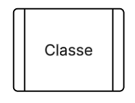
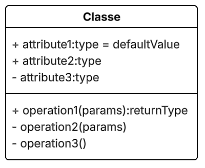
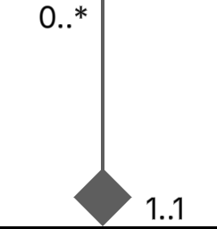
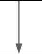

# Diagrama de classes

## Participantes

| Nome                      |
|---------------------------|
| [Breno Queiroz Lima](https://github.com/brenob6) |
| [Hauedy Wegener Soares](https://github.com/HauedyWS)   |
| [Matheus Barros do Nascimento](https://github.com/Ninja-Haiyai) |

## Introdução

O diagrama de classes descreve os tipos de objetos presentes no sistema e os vários tipos de relacionamentos estáticos existentes entre eles (FOWLER, Martin).

## Objetivo 

&emsp;&emsp;O diagrama de classes mostra a estrutura de um sistema de software, destacando as classes que o compõem, seus atributos, operações e as relações entre elas. A intenção é fornecer uma visão clara da organização das classes e da arquitetura geral do sistema, contribuindo para a compreensão técnica e o suporte às atividades de desenvolvimento. Além disso, o diagrama funciona como um documento essencial para programadores, analistas e demais participantes do projeto, oferecendo uma orientação precisa sobre o funcionamento do sistema. O esquema apresentado ilustra a organização do projeto de aprendizado de idiomas e seus componentes.

## Legenda

**Tabela 1** - Legenda

| Legenda | Representação |
| ------- | ------------- |
| Classe  |  |
| Classe, atributos e métodos | 
| Agregação |  |
| Dependência |  |

## Diagrama

## Bibliografia

> FOWLER, Martin. UML essencial. 3. ed. Porto Alegre: Bookman, 2011. E-book. p.52. ISBN 9788560031382. Disponível em: https://integrada.minhabiblioteca.com.br/reader/books/9788560031382/. Acesso em: 08 mai. 2025.

## Histórico de versões

| Versão |    Data    |                       Descrição                       |                       Autor(es)                        |                      Revisor(es)                       |
| :----: | :--------: | :---------------------------------------------------: | :----------------------------------------------------: | :----------------------------------------------------: |
| `1.0`  | 08/05/2025 | Introdução e imagem do diagrama confeccionado| [Breno Queiroz](https://github.com/brenob6)     | [Hauedy Wegener Soares](https://github.com/HauedyWS) e [Matheus Barros do Nascimento](https://github.com/Ninja-Haiyai) |
| `1.1`  | 09/05/2025 | Adiciona legenda | [Breno Queiroz](https://github.com/brenob6)     | [Hauedy Wegener Soares](https://github.com/HauedyWS) e [Matheus Barros do Nascimento](https://github.com/Ninja-Haiyai) |
| `1.2`  | 09/05/2025 | Adicionei o Objetivo | [Matheus Barros do Nascimento](https://github.com/Ninja-Haiyai)     | [Hauedy Wegener Soares](https://github.com/HauedyWS) e [Breno Queiroz](https://github.com/brenob6) |
