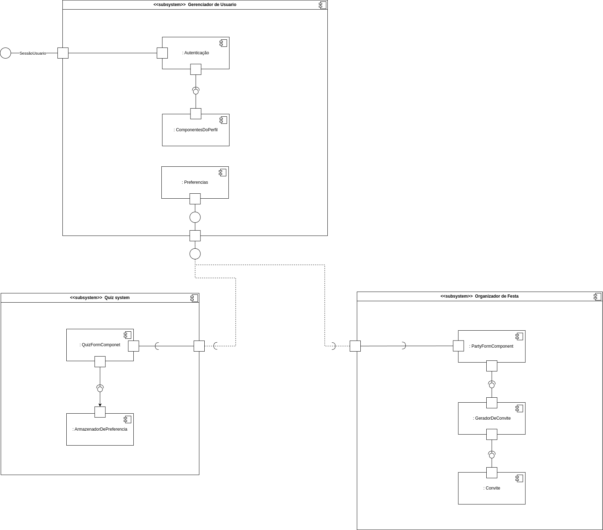

# Diagrama de Componentes

## Participações

| Nome                                 |
|--------------------------------------|
| [Hauedy Wegener Soares](https://github.com/HauedyWS)   |
| [Letícia Resende da Silva](https://github.com/LeticiaResende23) |
| [Leandro de Almeida Oliveira](https://github.com/leomitx10) |
| [Vinicius Castelo](https://github.com/Vini47) |

## Introdução 

 &emsp;&emsp; O diagrama de componentes é uma representação visual que descreve a organização e a interdependência entre os principais módulos de software, bibliotecas, serviços externos e demais elementos que compõem a arquitetura do sistema. Ele é fundamental na  arquitetura de software, pois oferece uma visão clara da estrutura do sistema e facilita o planejamento e a manutenção do sistema.

## Objetivo

 &emsp;&emsp; Apresentar o diagrama de componentes mostrando a estrutura modular da aplicação e as relações entre seus principais componentes. A intenção é fornecer uma visão clara da arquitetura do sistema, facilitando o entendimento técnico, a comunicação entre os membros da equipe e o suporte às atividades de desenvolvimento, manutenção e evolução do software.

## Metodologia

 &emsp;&emsp; Com base no material fornecido pela professora Milene Serrano sobre o diagrama de componentes da plataforma Aprender3, foi realizado um estudo para compreender os conceitos e as boas práticas de elaboração desse tipo de diagrama. Após essa etapa, o grupo utilizou a ferramenta LucidChart para fazer o diagrama.

## Diagrama

 &emsp;&emsp;Está presente na tabela 1 e imagem 1, o conteúdo e explicação dos elementos utilizados no desenvolvimento do diagrama de componentes do projeto. Vai servir como guia para o leitor entender melhor.

### Legenda

**Tabela 1** Legenda

| Legenda |    Representação    |
| :----: | :--------: |
| Símbolo de componente  | |
| conexão simples  | |
| conexão complexa  | |
| Símbolo de dependência | |
| Símbolo de porta| |

Autor(a): <a href="https://github.com/LeticiaResende23" target="_blank">Letícia Resende</a>

 

Imagem 1: diagrama de componentes.

Autor(a): <a href="https://github.com/HauedyWS" target="_blank">Hauedy Wegener</a>, <a href="https://github.com/leomitx10" target="_blank">Leandro de Almeida</a>, <a href="https://github.com/LeticiaResende23" target="_blank">Letícia Resende</a> e <a href="https://github.com/Vini47" target="_blank">Vinicius Castelo</a>

## Descrição

## Conclusão

 &emsp;&emsp;Este diagrama de componentes revela uma arquitetura de sistema bem definida e modular, onde um "Gerenciador de Usuário" centralizado lida com autenticação, perfis e preferências. Essa abordagem permite que subsistemas distintos, como o "Quiz System" e o "Organizador de Festa", reutilizem eficientemente as informações do usuário, especialmente as preferências, para personalizar suas funcionalidades e promover uma experiência coesa, ao mesmo tempo em que mantêm uma clara separação de responsabilidades e promovem o baixo acoplamento através de interações baseadas em interfaces.

## Bibliografia

[1] **LUCIDCHART**. *Diagrama de componentes UML*. Disponível em: <https://www.lucidchart.com/pages/pt/diagrama-de-componentes-uml>. Acesso em: 08 Mai. 2025.

[2] **SERRANO, M.** *VideoAula - DSW-Modelagem - Componentes*. Disponível em: https://unbbr-my.sharepoint.com/personal/mileneserrano_unb_br/_layouts/15/stream.aspx?id=%2Fpersonal%2Fmileneserrano%5Funb%5Fbr%2FDocuments%2FArqDSW%20%2D%20V%C3%ADdeosOriginais%2F05h%20%2D%20VideoAula%20%2D%20DSW%2DModelagem%20%2D%20Componentes%2Emp4&ga=1&referrer=StreamWebApp%2EWeb&referrerScenario=AddressBarCopied%2Eview%2E48255f82%2D8fdc%2D49e2%2Da6c1%2D0b2efb3cee02. Acesso em: 08 Mai. 2025.

## Histórico de versões

| Versão |    Data    |                       Descrição                       |                       Autor(es)                        |                      Revisor(es)                       |
| :----: | :--------: | :---------------------------------------------------: | :----------------------------------------------------: | :----------------------------------------------------: |
| `1.0`  | 07/05/2025 | Adicionando a introdução e o objetivo, realizei o subsystem Organizador de festa do diagrama de componentes| [Leandro de Almeida Oliveira](https://github.com/leomitx10) | [Hauedy Wegener Soares](https://github.com/HauedyWS), [Letícia Resende](https://github.com/LeticiaResende23) e [Vinicius Castelo](https://github.com/Vini47) |
| `1.1`  | 09/05/2025 | Adicionando metodologia e legenda, realizei o subsystem Gerenciador de Usuário do diagrama de componentes | [Letícia Resende](https://github.com/LeticiaResende23) | [Hauedy Wegener Soares](https://github.com/HauedyWS), [Leandro de Almeida Oliveira](https://github.com/leomitx10) e [Vinicius Castelo](https://github.com/Vini47) |
| `1.2`  | 09/05/2025 | Adicionado a conclusão e as referências relativas ao Diagrama de componentes | [Vinicius Castelo](https://github.com/Vini47) | [Hauedy Wegener Soares](https://github.com/HauedyWS), [Leandro de Almeida Oliveira](https://github.com/leomitx10) e [Letícia Resende](https://github.com/LeticiaResende23) |
