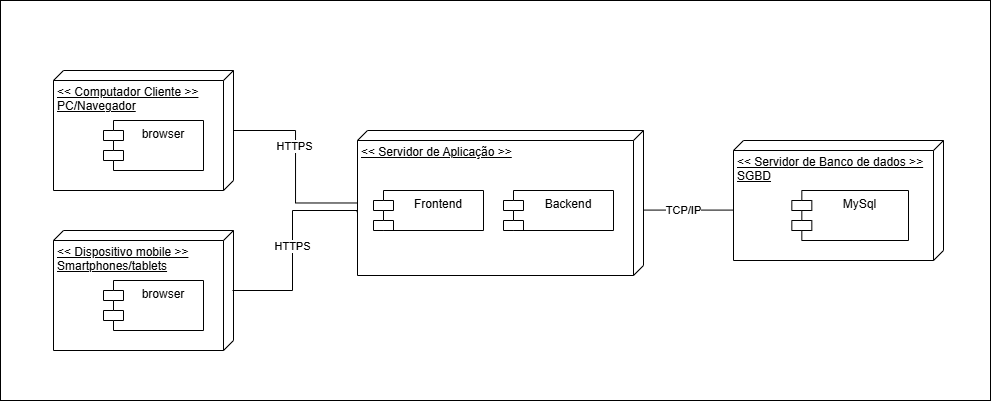

# Diagrama de Implantação

## Participantes

| Nome                      |
|---------------------------|
| [Breno Fernandes](https://github.com/brenofrds) |
| [Bruno Ricardo](https://github.com/EhOBruno)   |
| [Mayara Alves de Oliveira](https://github.com/mayara-tech) | 
| [Bruno de Oliveira](https://github.com/BrunoOLiveirax) |

## Introdução

 &emsp;&emsp;O Diagrama de Implantação é uma ferramenta da UML (Unified Modeling Language) utilizada para representar a arquitetura física do sistema, mostrando como os componentes de software são distribuídos em diferentes nós da infraestrutura. Ele ilustra os dispositivos e servidores envolvidos, as conexões entre eles e os componentes de software implantados em cada ambiente.

 &emsp;&emsp;Esse tipo de diagrama permite visualizar a estrutura física do sistema, facilitando o entendimento da distribuição, comunicação e integração entre os diferentes elementos que compõem a solução.

## Objetivo

 &emsp;&emsp;O objetivo do Diagrama de Implantação é apresentar a arquitetura física do sistema, destacando a distribuição dos componentes de software (Frontend, Backend, Banco de Dados), os dispositivos cliente (PCs e dispositivos móveis) e os meios de comunicação utilizados (HTTPS, TCP/IP). Dessa forma, o diagrama auxilia na definição da infraestrutura necessária para o funcionamento do sistema, garantindo maior clareza para o time de desenvolvimento, operações e stakeholders técnicos.

## Metodologia

 &emsp;&emsp;A construção do Diagrama de Implantação foi feita de forma conjunta por toda a equipe. Todos os integrantes assistiram aos conteúdos disponibilizados pela professora na plataforma Aprender, além de buscarem referências em outros canais, como vídeos no YouTube, para aprofundar o entendimento sobre diagramas de Implantação.

 &emsp;&emsp;Após esse momento de estudo em grupo, nos reunimos para discutir e elaborar o diagrama de forma colaborativa, identificando juntos os dispositivos clientes, os servidores, os componentes de software e os meios de comunicação utilizados. O trabalho foi desenvolvido em equipe, garantindo que todas as decisões fossem validadas coletivamente e que o resultado final representasse de forma clara e precisa a infraestrutura do sistema.

## Diagrama

Figura 1: Diagrama de Implantação.

Autores: Breno Soares, Bruno de Oliveira, Bruno Ricardo e Mayara Alves. 

 

## Descrição do Diagrama

- **Dispositivos Cliente:**  
  Usuários acessam o sistema por navegadores em computadores ou dispositivos móveis.

- **Servidor de Aplicação:**  
  Responsável por hospedar o **Frontend** (interface do usuário) e o **Backend** (lógica de negócios e API).

- **Comunicação Segura (HTTPS):**  
  Garante a segurança na troca de informações entre os dispositivos cliente e o servidor.

- **Servidor de Banco de Dados:**  
  Armazena as informações do sistema utilizando o **MySQL**.

- **Comunicação Interna (TCP/IP):**  
  Permite a troca de dados entre o servidor de aplicação e o banco de dados.

## Conclusão

 &emsp;&emsp;O Diagrama de Implantação apresentado oferece uma visão clara e objetiva da arquitetura física do sistema, destacando a distribuição dos componentes de software e sua interação com os dispositivos e servidores envolvidos. Ele ilustra a comunicação entre os dispositivos clientes (PCs e dispositivos móveis), o servidor de aplicação (com seus componentes Frontend e Backend) e o servidor de banco de dados, demonstrando como as tecnologias de comunicação, como HTTPS e TCP/IP, são utilizadas para garantir o funcionamento do sistema de maneira eficiente.

 &emsp;&emsp;A construção do diagrama em equipe permitiu uma análise mais detalhada e colaborativa da infraestrutura do sistema, garantindo que as soluções fossem bem fundamentadas e alinhadas ao projeto. O Diagrama de Implantação complementa a documentação técnica e serve como base para futuras melhorias e manutenção da infraestrutura.

## Bibliografia

> 
Diagrama de Implantação UML. *https://www.youtube.com/watch?v=DgERD0HgggQ*. Acesso em: 07 de maio de 2025.

## Histórico de Versões

| Versão |    Data    |                         Descrição                         |                           Autor(es)                           |
|:-----:|:---------:|:---------------------------------------------------------:|:-------------------------------------------------------------:|
| `1.0` | 06/05/2025 | Estudo sobre diagramas de implantação utilizando Aprender e YouTube | [Breno Fernandes](https://github.com/brenofrds), [Bruno Ricardo](https://github.com/EhOBruno), [Mayara Alves de Oliveira](https://github.com/mayara-tech), [Bruno de Oliveira](https://github.com/BrunoOLiveirax) |
| `1.1` | 07/05/2025 | Elaboração conjunta do diagrama com definição dos componentes e tecnologias | [Breno Fernandes](https://github.com/brenofrds), [Bruno Ricardo](https://github.com/EhOBruno), [Mayara Alves de Oliveira](https://github.com/mayara-tech), [Bruno de Oliveira](https://github.com/BrunoOLiveirax) |
| `1.2` | 09/05/2025 | Organização da documentação no repositório e descrição do diagrama | [Breno Fernandes](https://github.com/brenofrds), [Bruno Ricardo](https://github.com/EhOBruno), [Mayara Alves de Oliveira](https://github.com/mayara-tech), [Bruno de Oliveira](https://github.com/BrunoOLiveirax) |
