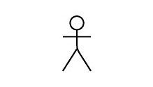
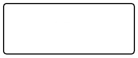
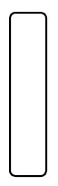
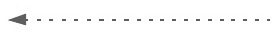
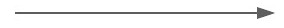
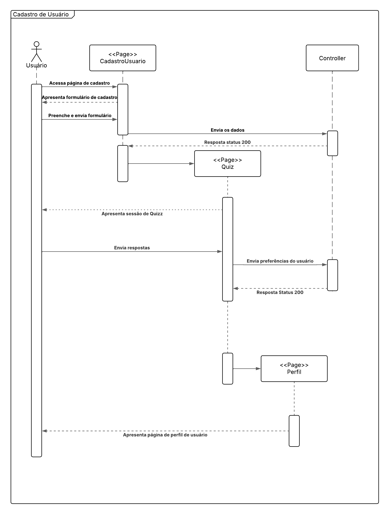

# Diagrama de sequência

## Participantes

| Nome                      |
|---------------------------|
| [Breno Queiroz Lima](https://github.com/brenob6) |
| [Matheus Barros do Nascimento](https://github.com/Ninja-Haiyai) |
| [Leandro de Almeida Oliveira](https://github.com/leomitx10)  |

## Introdução 

 &emsp;&emsp; O diagrama de sequência descreve a interação entre objetos ou componentes de um sistema ao longo do tempo. Ele mostra a troca de mensagens entre os elementos envolvidos em um determinado cenário ou funcionalidade, evidenciando a ordem das chamadas e o fluxo de controle. Esse tipo de diagrama é essencial na modelagem dinâmica de sistemas, pois permite compreender o comportamento do sistema em tempo de execução e identificar possíveis melhorias na lógica de interação entre seus elementos.

## Objetivo

&emsp;&emsp;Apresentar o diagrama de sequência mostrando a dinâmica de interação entre os componentes do sistema ao longo do tempo. A intenção é fornecer uma visão clara do fluxo de mensagens e do comportamento dos elementos em cenários específicos, contribuindo para o entendimento técnico e o suporte às atividades de desenvolvimento.

## Metodologia

 &emsp;&emsp; Com base no material fornecido pela professora Milene Serrano sobre o diagrama de sequência da plataforma Aprender3, foi realizado um estudo para compreender os conceitos e as boas práticas de elaboração desse tipo de diagrama. Após essa etapa, o grupo utilizou a ferramenta LucidChart.

## Diagrama

 &emsp;&emsp;Está presente na tabela 1 e imagem 1, o conteúdo e explicação dos elementos utilizados no desenvolvimento do diagrama de sequência do software do projeto. Vai servir como guia para o leitor entender melhor.

### Legenda

**Tabela 1** Legenda

| Legenda |    Representação    |
| :----: | :--------: |
| Símbolo de ator |  |
| Símbolo de linha da vida | .png) |
| Símbolo de Objeto |  |
| Caixa de ativação |  |
| Símbolo de mensagens de retorno assíncronas |  |
| Símbolo de mensagens síncronas |  |

Autor(a): <a href="https://github.com/leomitx10" target="_blank">Leandro de Almeida Oliveira</a>

 

Imagem 1: diagrama de sequência.

Autor(a): <a href="https://github.com/leomitx10" target="_blank">Leandro de Almeida Oliveira</a>, <a href="https://github.com/brenob6" target="_blank">Breno Queiroz</a> e <a href="https://github.com/Ninja-Haiyai" target="_blank">Matheus Barros do Nascimento</a> 

## Descrição

&emsp;&emsp;O processo se inicia quando o usuário acessa a página de cadastro no sistema. A interface correspondente, chamada de CadastroUsuario, é carregada e apresenta ao usuário um formulário de cadastro. O usuário então preenche e envia esse formulário com seus dados.

&emsp;&emsp;Assim que o formulário é enviado, a página CadastroUsuario encaminha os dados ao Controller, responsável por processar a requisição no backend. Após o processamento, o Controller retorna uma resposta com status 200, indicando que o cadastro foi realizado com sucesso.

&emsp;&emsp;Com a confirmação do cadastro, o sistema redireciona o usuário para a página Quiz, que é apresentada com uma série de perguntas para coletar preferências do usuário. O usuário responde ao quiz e envia essas informações, que novamente são enviadas ao Controller. O Controller processa as respostas e retorna mais uma resposta com status 200, indicando que as preferências foram armazenadas com sucesso.

&emsp;&emsp;Concluída essa etapa, o sistema redireciona o usuário para a página Perfil, onde é apresentada ao usuário a página de perfil com as informações consolidadas.

## Conclusão

&emsp;&emsp;O diagrama de sequência criado oferece uma visão nítida e estruturada de como se dá o processo de registro de usuários no sistema, detalhando cada interação, desde o primeiro acesso à página de registro até a conclusão no perfil do usuário. Este modelo auxilia na identificação dos pontos de interação entre os diversos componentes (usuário, páginas do sistema e controlador), facilitando a compreensão de como os dados são transmitidos e as reações esperadas em cada fase.

&emsp;&emsp;O diagrama, além de simplificar a compreensão do funcionamento interno, atua como um recurso útil para auxiliar a equipe de desenvolvimento, tanto na harmonização das expectativas quanto na detecção de possíveis correções ou aprimoramentos. Ele enfatiza a relevância de registrar não somente a estrutura, mas também os processos relacionados ao produto.

## Bibliografia

>[1] Bóson Treinamentos. **Curso de UML — O que é um Diagrama de Sequência**. Disponível em: [https://www.youtube.com/watch?v=UVkj3ed0ZuM](https://www.youtube.com/watch?v=UVkj3ed0ZuM). Acesso em: 09 maio 2025.

>[2] IBM. **Diagramas de Seqüência**. Disponível em: [https://www.ibm.com/docs/pt-br/rsm/7.5.0?topic=uml-sequence-diagrams](https://www.ibm.com/docs/pt-br/rsm/7.5.0?topic=uml-sequence-diagrams). Acesso em: 09 maio 2025.

## Histórico de versões

| Versão |    Data    |                       Descrição                       |                       Autor(es)                        |                      Revisor(es)                       |
| :----: | :--------: | :---------------------------------------------------: | :----------------------------------------------------: | :----------------------------------------------------: |
| `1.0`  | 08/05/2025 | Imagem do diagrama confeccionado| [Breno Queiroz](https://github.com/brenob6)     | [Leandro de Almeida Oliveira](https://github.com/leomitx10) e [Matheus Barros do Nascimento](https://github.com/Ninja-Haiyai) |
| `1.1`  | 08/05/2025 | Adicionei a introdução, o objetivo e a metodologia | [Leandro de Almeida Oliveira](https://github.com/leomitx10) | [Breno Queiroz](https://github.com/brenob6) e [Matheus Barros do Nascimento](https://github.com/Ninja-Haiyai) |
| `1.2`  | 09/05/2025 | Adicionei a conclusão e bibliografia | [Matheus Barros do Nascimento](https://github.com/Ninja-Haiyai) | [Breno Queiroz](https://github.com/brenob6) e [Leandro de Almeida Oliveira](https://github.com/leomitx10) |

