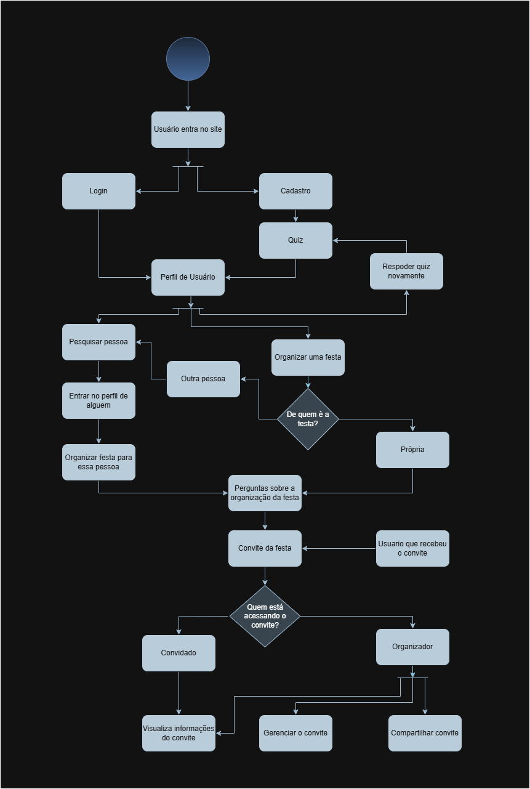

# Diagrama de Atividades

## Participantes

| Nome                      | 
|---------------------------|
| [Breno Fernandes Soares](https://github.com/brenofrds) | 
| [Bruno Ricardo de Menezes ](https://github.com/EhOBruno) |
| [Mayara Alves de Oliveira](https://github.com/mayara-tech) | 

## Introdução 

 &emsp;&emsp; Um diagrama de atividade é essencialmente um fluxograma que mostra as atividades executadas por um sistema, representando o fluxo de trabalho e as interações entre as diferentes ações. Ele ilustra como as atividades são realizadas de maneira sequencial ou paralela, facilitando a visualização e compreensão dos processos e tarefas dentro do sistema.

## Objetivo

 &emsp;&emsp; Apresentar o diagrama de componentes mostrando a estrutura modular da aplicação e as relações entre seus principais componentes. A intenção é fornecer uma visão clara da arquitetura do sistema, facilitando o entendimento técnico, a comunicação entre os membros da equipe e o suporte às atividades de desenvolvimento, manutenção e evolução do software.

## Metodologia

 &emsp;&emsp; Com base no material fornecido pela professora Milene Serrano sobre o diagrama de componentes da plataforma Aprender3, foi realizado um estudo para compreender os conceitos e as boas práticas de elaboração desse tipo de diagrama. Após essa etapa, o grupo utilizou a ferramenta Drawio.

## Diagrama

## Histórico de versões

| Versão |    Data    |                       Descrição                       |                       Autor(es)                        |                      Revisor(es)                       |
| :----: | :--------: | :---------------------------------------------------: | :----------------------------------------------------: | :----------------------------------------------------: |
| `1.0`  | 09/05/2025 | Criação da página | [Bruno Ricardo de Menezes ](https://github.com/EhOBruno) | [Breno Fernandes Soares](https://github.com/brenofrds) |
