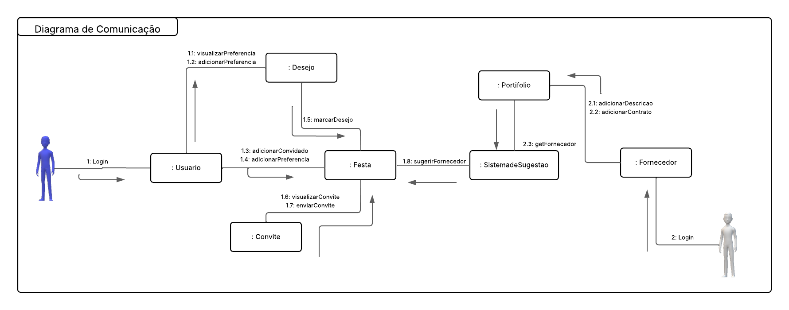

# Diagrama de comunicação

## Participantes

| Nome                      | 
|---------------------------|
| [Mayara Alves de Oliveira](https://github.com/mayara-tech) | 
| [Bruno de Oliveira](https://github.com/BrunoOLiveirax) |

## Introdução 

O Diagrama de Comunicação é uma ferramenta da UML (Unified Modeling Language) utilizada para representar, de forma clara e organizada, as interações entre objetos em um determinado cenário do sistema. Ele foca na troca de mensagens e na sequência dessas interações, evidenciando como os elementos do sistema colaboram entre si para realizar uma funcionalidade. A partir da modelagem da comunicação, é possível compreender melhor a lógica interna dos processos, aprimorando a estrutura do software e a comunicação entre as equipes de desenvolvimento.

## Objetivo

O objetivo deste Diagrama de Comunicação é ilustrar como os objetos do sistema interagem durante a execução de um caso de uso específico, destacando a ordem das mensagens trocadas e os relacionamentos estabelecidos. Essa modelagem contribui para o entendimento detalhado do comportamento do sistema, apoiando a validação dos requisitos e o alinhamento entre análise e implementação.

## Desenvolvimento

Para a construção do Diagrama de Comunicação, utilizamos a ferramenta Lucidchart, que proporcionou um ambiente colaborativo e visualmente organizado para o mapeamento das interações do sistema. A modelagem foi realizada com base em uma reunião entre os dois integrantes responsáveis, onde discutimos e levantamos todos os processos envolvidos e que seriam modelados. 

Durante esse encontro, foram identificados os processos participantes assim como a sequência lógica. A partir disso, estruturamos o diagrama de forma a representar com clareza a dinâmica da comunicação entre os componentes do sistema, seguindo os padrões da UML.

## Diagrama

O diagrama apresentado na figura 1 tem como objetivo representar visualmente a interação entre os principais pontos do sistema QuemFazNiver_GostaDe.

Figura 1: diagrama de comunicação.

Fonte: Mayara Alves e Bruno de Oliveira 

 

O Diagrama de Comunicação desenvolvido busca representar a dinâmica entre os diversos objetos e atores envolvidos no processo de organização de uma festa, dentro do sistema. Abaixo, detalhamos os principais elementos modelados:

### Atores

- **Usuário**  
  Representa o cliente que utiliza o sistema para planejar uma festa. Suas interações iniciam com o login (`1: Login`) e seguem com ações como visualizar e adicionar preferências, convidar pessoas, e enviar convites.

- **Fornecedor**  
  Atua como prestador de serviços para festas. Também realiza login (`2: Login`) e interage com o sistema ao adicionar uma descrição de seus serviços e contratos.

### Objetos Internos

- `:Usuario`
  Objeto responsável por processar as ações do ator "Usuário". Ele executa as funções de:
  - `1.1: visualizarPreferencia` – permite ao usuário ver preferências existentes.
  - `1.2: adicionarPreferencia` – permite ao usuário adicionar novas preferências.
  - `1.3: adicionarConvidado` – adiciona convidados à festa.
  - `1.4: adicionarPreferencia` – envia preferências para o objeto `Festa`.

- `:Desejo`  
  Reflete os interesses e preferências específicas do usuário:
  - `1.5: marcarDesejo` – registra os desejos do usuário, vinculando-os à festa.

- `:Festa` 
  Objeto central do sistema. Nele se concentram as funcionalidades principais da organização do evento:
  - Recebe dados como convidados, preferências e desejos.
  - Interage com `:Convite` para:
    - `1.6: visualizarConvite`
    - `1.7: enviarConvite`
  - Envia solicitação para o sistema de sugestão com:
    - `1.8: sugerirFornecedor`

- `:Convite` 
  Gerencia os convites associados a uma festa:
  - Utilizado para visualizar (`1.6`) e enviar (`1.7`) convites aos participantes.

- `:SistemadeSugestao` 
  Módulo que analisa dados e preferências para indicar fornecedores relevantes:
  - Recebe a solicitação `1.8: sugerirFornecedor`.
  - Executa `2.3: getFornecedor` para buscar dados no `Portifolio`.

- `:Portifolio` 
  Componente de apoio que armazena os dados dos fornecedores disponíveis:
  - Consulta realizada pelo sistema `2.3: getFornecedor`.

- `:Fornecedor`  
  Representa o prestador de serviço que após o login:
  - Adiciona sua descrição de serviços com `2.1: adicionarDescricao`.
  - Adiciona os contratos com `2.2: adicionarContrato`.

## Bibliografia 

> FOWLER, Martin. UML essencial. 3. ed. Porto Alegre: Bookman, 2011. E-book. p.52. ISBN 9788560031382. Disponível em: https://integrada.minhabiblioteca.com.br/reader/books/9788560031382/. Acesso em: 06 mai. 2025.

## Histórico de versões

| Versão |    Data    |                       Descrição                       |                       Autor(es)                        |                      Revisor(es)                       |
| :----: | :--------: | :---------------------------------------------------: | :----------------------------------------------------: | :----------------------------------------------------: 
| `1.0`  | 07/05/2025|  Criação do esboço do diagrama de comunicação |[Bruno de Oliveira](https://github.com/BrunoOLiveirax)  | [Mayara Alves ](https://github.com/mayara-tech) |
| `1.1`  | 08/05/2025| Criação do modelo definitivo do diagrama de comunicação |[Mayara Alves ](https://github.com/mayara-tech)  | [Bruno de Oliveira](https://github.com/BrunoOLiveirax) |
| `1.2`  | 08/05/2025|  Revisão do modelo e adição do fluxo |[Bruno de Oliveira](https://github.com/BrunoOLiveirax)  | [Mayara Alves ](https://github.com/mayara-tech) |
| `1.3`  | 09/05/2025| Criação da página no repositório do projeto |[Mayara Alves ](https://github.com/mayara-tech)  | [Bruno de Oliveira](https://github.com/BrunoOLiveirax) |
| `1.4`  | 09/05/2025| Adição da estrutura da página |[Mayara Alves ](https://github.com/mayara-tech)  | [Bruno de Oliveira](https://github.com/BrunoOLiveirax) |
| `1.5`  | 09/05/2025| Adição da descrição do diagrama|[Mayara Alves ](https://github.com/mayara-tech)  | [Bruno de Oliveira](https://github.com/BrunoOLiveirax) |