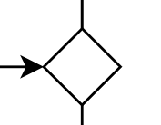

# Diagrama de Estados

## Participações
| Nome                      |
|---------------------------|
| [Hauedy Wegener Soares](https://github.com/HauedyWS)  |
| [Letícia Resende da Silva ](https://github.com/LeticiaResende23)  |
| [Vinicius Castelo](https://github.com/Vini47)  |

## Introdução

 &emsp;&emsp; O diagrama de estados é uma ferramenta crucial para representar os aspectos dinâmicos de sistemas. Ele serve para descrever as sequências de estados que um objeto atravessa ao longo de sua existência, como resposta a eventos, além das reações desses objetos a tais eventos. Cada estado reflete uma condição ou situação na trajetória de um objeto, em que ele atende a certas condições, realiza atividades ou aguarda a ocorrência de eventos. Eventos são acontecimentos significativos que podem acionar mudanças de estado, enquanto as transições são relações entre os estados, indicando alterações específicas quando eventos e condições se combinam de maneira particular. Os diagramas de estados, ao representar visualmente esses conceitos, são essenciais para compreender e documentar o comportamento dos objetos dentro de um sistema.

## Objetivos

 &emsp;&emsp;Este documento tem como propósito complementar a descrição das classes, fornecendo detalhes sobre os possíveis estados que os objetos de uma classe específica podem adotar e os eventos do sistema que provocam essas alterações. O objetivo é especificar a dinâmica do sistema por meio de diagramas de estados, cobrindo o comportamento completo de uma classe em todos os casos de uso relevantes. Dessa forma, o diagrama de estados proporciona uma visão abrangente do comportamento dos objetos de uma classe, permitindo antecipar todas as reações de um objeto frente aos eventos que ele possa experimentar. Além disso, o documento busca esclarecer quando e como empregar diagramas de estados, ressaltando suas notações e a importância de analisar as transições de estados para capturar o ciclo de vida dos objetos, subsistemas e sistemas como um todo.

## Metodologia

 &emsp;&emsp;A construção do diagrama de estados foi baseada no material disponibilizado pela professora, que serviu como referência para compreender os conceitos e aplicá-los corretamente. Além disso, o diagrama foi elaborado de forma colaborativa durante uma reunião online, na qual o grupo discutiu e decidiu em conjunto os estados e transições mais adequados para representar o comportamento do sistema de maneira clara e coerente.

## Legenda

**Tabela 1** Legenda

| Legenda |    Representação    |
| :----: | :--------: |
| Estado incial |  |
| Estado final |  |
| Processo intermediario de escolha |  |
| Estado |  |
| Representação de uma Pagina |  |

### Diagrama Geral

Figura 2: estado geral.

Autor(a): <a href="https://github.com/LeticiaResende23" target = "_blank">Letícia Resende</a>, <a href="https://github.com/HauedyWS" target = "_blank">Hauedy Wegener</a>, <a href="https://github.com/Vini47" target = "_blank">Vinicius Castelo</a>

 

A Figura 2 apresenta de maneira geral o resultado final do diagrama de estados. Os estados compostos subsequentes oferecem uma visualização mais detalhada e focada.

### Estado composto Logando

Figura 3: estado composto logando.

Autor(a): <a href="https://github.com/LeticiaResende23" target = "_blank">Letícia Resende</a>

 

 &emsp;&emsp;Na Figura 3 que representa o estado composto logando, inicia com o subestado "Fornecendo os dados de autenticação" esse estado seria o preenchimento do usuário nos campos de login, a mudança de estado ocorre logo em seguida, com a presença de uma Escolha representado pelo simbolo observado na Figura 1 e explicado na Tabela 1, nele ha duas escolhas a que o resultado deu validado, esse sendo a primeira saída dos subestados, e o resultado de invalidado, que representa quando os dados do usuário não são compatíveis aos que estão cadastrado no banco de dados, neste o caminho é diferente do validado, indo para o subestado "Preenchendo as informações de recuperação", representando o estado em que o usuário insere dados para a recuperação de senha, em seguida vem o "enviando instruções de recuperação", o qual o sistema enviará por email do usuário a redefinição de senha, no estado posterior "recuperando senha" é o estado em que o usuário estará seguindo as instruções do sistema pelo email e assim que concluir irá retorna para o primeiro estado "Fornecendo os dados de autenticação" para acessar o sistema.

### Estado Perfil Acessado e Quiz Acessado

Figura 4 e 5: estado composto logando.

Na figura 3 representa o conjunto de estados possiveis na Pagina do Perfil após o login, sendo possivel acessar o album e retorar para o pefil, ou sair dessa pagina e acessar a pagina do Quiz (figura 5) ou o Organizar festa. Na figura 5 está representado os estados do formulado e o estado intermediario entre o possivel erro e a atualização das preferencias.

Autor(a): <a href="https://github.com/HauedyWS" target = "_blank">Hauedy Wegener</a>

 

### Estado composto Organizar a Festa

Figura 6: estado composto Organizar a Festa.

  

Autor(a): <a href="https://github.com/Vini47" target="_blank">Vinicius Castelo</a>

 

 &emsp;&emsp;Na etapa **Organizar a Festa**, assim que o usuário acessa o recurso, o sistema exibe um formulário para que ele defina os detalhes essenciais do evento (tema, data, local etc.). Uma vez preenchidos esses campos, o usuário seleciona os convidados que receberão o convite. Esses dados passam por uma checagem de validade: se algo falhar (por exemplo, erro de conexão ou dados inconsistentes), o fluxo retorna a uma mensagem de erro, permitindo a correção sem sair da tela. Quando todas as informações são validadas com sucesso, o sistema gera automaticamente o convite e sinaliza o término do processo, disponibilizando ainda a opção de logout para que o usuário encerre sua sessão com segurança.

### Estado composto Cadastrando

Figura 7: estado composto Cadastrando.

  

Autor(a): <a href="https://github.com/Vini47" target="_blank">Vinicius Castelo</a>

 

 &emsp;&emsp;Na fase **Cadastrando**, o usuário inicia o fluxo inserindo seus dados cadastrais no formulário disponibilizado pelo sistema. Assim que ele submete essas informações, o sistema executa uma validação interna: se algum campo estiver inválido ou faltando, é exibida uma mensagem de erro, e o usuário permanece na mesma página para corrigir as inconsistências. Quando todos os dados são aprovados, o processo avança para o estado final de cadastro, onde o novo usuário é oficialmente registrado na aplicação.

## Conclusão

 &emsp;&emsp;Este diagrama ilustra de forma clara e íntegra o fluxo de interação do usuário com o sistema, desde a autenticação (login, recuperação de senha e cadastro) até o acesso ao perfil, momento a partir do qual o usuário pode optar por participar de quizzes interativos ou gerenciar todos os detalhes de uma festa (definição de tema, lista de convidados e envio de convites). Cada etapa contempla tanto os caminhos de sucesso — em que os dados são validados e as funcionalidades executadas — quanto os cenários de erro ou conexão, garantindo retornos adequados ao usuário e mantendo a integridade do processo. Ao final, o logout encerra qualquer sessão ativa, reforçando a segurança e o controle de acesso. Este fluxo coeso exemplifica uma solução completa, que alia usabilidade, confiabilidade e flexibilidade para atender às diferentes necessidades dos usuários.

## Bibliografia

[1] **LUCIDCHART**. *Diagrama de estados UML*. Disponível em: <https://www.lucidchart.com/pages/pt/o-que-e-diagrama-de-maquina-de-estados-uml>. Acesso em: 08 Mai. 2025.

[2] **SERRANO, M.** *VideoAula - DSW-Modelagem - Estados*. Disponível em: https://unbbr-my.sharepoint.com/personal/mileneserrano_unb_br/_layouts/15/stream.aspx?id=%2Fpersonal%2Fmileneserrano%5Funb%5Fbr%2FDocuments%2FArqDSW%20%2D%20V%C3%ADdeosOriginais%2F06d%20%2D%20VideoAula%20%2D%20DSW%2DModelagem%20%2D%20Estados%2Emp4&ga=1&referrer=StreamWebApp%2EWeb&referrerScenario=AddressBarCopied%2Eview%2Ec5c106d9%2Df564%2D4e5f%2D9c80%2Db94f54113ce5. Acesso em: 08 Mai. 2025.

## Histórico de versões

| Versão |    Data    |                       Descrição                       |                       Autor(es)                        |                      Revisor(es)                       |
| :----: | :--------: | :---------------------------------------------------: | :----------------------------------------------------: | :----------------------------------------------------: |
| `1.0`  | 07/05/2025 | Adicionando Introdução e Objetivo, realizei a parte do estado composto logando e quiz acessado     | [Letícia Resende](https://github.com/LeticiaResende23)     | [Hauedy Wegener Soares](https://github.com/HauedyWS) e [Vinicius Castelo](https://github.com/Vini47) |
| `1.1`  | 09/05/2025 | Adicinei metodologia e Legenda, contribui o estado perfilacessado e quiz acessado e com o entendimento encessario para a criaçao do diagrama no geral   | [Hauedy Wegener Soares](https://github.com/HauedyWS)  | [Letícia Resende](https://github.com/LeticiaResende23) e [Vinicius Castelo](https://github.com/Vini47) |
| `1.2`  | 09/05/2025 | Adicionado a conclusão e as referências relativas ao Diagrama de componentes     | [Vinicius Castelo](https://github.com/Vini47)     | [Hauedy Wegener Soares](https://github.com/HauedyWS) e [Letícia Resende](https://github.com/LeticiaResende23) |
| `1.3`  | 09/05/2025 | Adicionado contribui com o cadastrando e organização de festa   | [Vinicius Castelo](https://github.com/Vini47)     | [Hauedy Wegener Soares](https://github.com/HauedyWS) e [Letícia Resende](https://github.com/LeticiaResende23) |