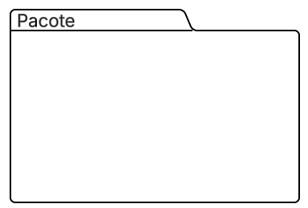
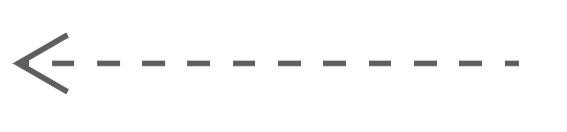

# Diagrama de Pacotes

## Participações

| Nome                      |
|---------------------------|
| [Breno Queiroz Lima](https://github.com/brenob6) |
| [Hauedy Wegener Soares](https://github.com/HauedyWS)   |
| [Leandro de Almeida Oliveira](https://github.com/leomitx10)  |
| [Letícia Resende da Silva ](https://github.com/LeticiaResende23) |
| [Matheus Barros do Nascimento](https://github.com/Ninja-Haiyai) |

## Introdução 

 &emsp;&emsp;Este documento aborda o conteúdo relacionado ao diagrama de pacotes, explicando como foi elaborado e fornecendo uma descrição detalhada do diagrama criado. O diagrama de pacotes ilustra a estrutura organizacional da arquitetura de qualquer classificador UML, sendo, no caso deste projeto, a arquitetura do software. Os elementos presentes neste tipo de diagrama, conforme o padrão UML, estão interconectados, incluindo pacotes, classes e documentos, com uma hierarquia entre eles. Um pacote pode ser entendido como uma pasta que contém arquivos de um sistema ou projeto UML, podendo também incluir outros pacotes, além de classes e documentos. Para mais informações sobre os elementos utilizados, consulte a Imagem 1 e a Tabela 1, além da explicação no tópico sobre o Diagrama.

## Objetivo

 &emsp;&emsp;O objetivo deste documento é apresentar o diagrama de pacotes desenvolvido pelo grupo, explicando sua estrutura e os seus elementos. A intenção é mostrar de forma clara e organizada a arquitetura do software do projeto, dividida em frontend e backend.
 

## Metodologia

&emsp;&emsp;Com base no material fornecido pela professora Milene Serrano sobre o diagrama de pacotes da plataforma Aprender3, foi realizado um estudo para compreender os conceitos e as boas práticas de elaboração desse tipo de diagrama. Após essa etapa, o grupo utilizou a ferramenta Lucidchart para construir dois diagramas de pacotes: um representando a estrutura do frontend e outro, do backend da aplicação.

## Diagrama

 &emsp;&emsp;Está presente na tabela 1 e imagens 1 e 2 , o conteúdo e explicação dos elementos utilizados no desenvolvimento do diagrama de pacotes do software do projeto. Vai servir como guia para o leitor entender melhor.

### Legenda

**Tabela 1** Legenda

| Legenda |    Representação    |
| :----: | :--------: |
| Pacote  |  |
| Dependência  |  |

Imagem 1: diagrama de pacotes (Frontend).

Autor(a): <a href="https://github.com/HauedyWS" target = "_blank">Hauedy Wegener</a>, <a href="https://github.com/LeticiaResende23" target = "_blank">Letícia Resende</a>

 

Imagem 2: diagrama de pacotes (Backend).

Autor(a): <a href="https://github.com/brenob6" target = "_blank">Breno Queiroz</a>, <a href="https://github.com/leomitx10" target = "_blank">Leandro de Almeida</a>, <a href="https://github.com/Ninja-Haiyai" target = "_blank">Matheus Barros</a>

 

## Explicação do Frontend

&emsp;&emsp;O diagrama de pacotes fronted (imagem 1) representa a estrutura de diretórios que será utilizada no desenvolvimento da aplicação React. Os
diretórios seguem padrões comuns em diversos padrões que utilizam desse do *framework* React.

- **src**: diretório *source*.
    - **hooks**: implementação de [*custom hooks*](https://react.dev/learn/reusing-logic-with-custom-hooks).
    - **contexts**: definição de [contexts](https://react.dev/reference/react/createContext).
    - **providers**: definição de [providers](https://react.dev/reference/react/createContext#provider).
    - **utils**: armazenamento de funções utilitárias, auxiliares que podem ser reutilizadas em toda a aplicação. 
    - **services**: comunicação com API.
    - **components**: [componentes](https://react.dev/learn/your-first-component) da aplicação.
- **pages**: páginas da aplicação, muitos frameworks React fazem [*File-based routing*](https://nextjs.org/docs/pages).

## Explicação do Backend

 &emsp;&emsp;O diagrama de pacotes do backend (imagem 2) representa a API que será desenvolvida com Django e Django REST Framework. O projeto principal se chama QuemFazNiverGostaDe e é dividido em duas pastas principais: apps e config.

 &emsp;&emsp;A pasta apps reúne os módulos que compõem as funcionalidades do sistema. O principal módulo é eventos, que representa uma área específica da aplicação voltada ao gerenciamento de eventos na API. Dentro desse módulo, há subpacotes organizados conforme a arquitetura recomendada pelo Django REST Framework, incluindo:

* **admin**: configurações de registro e customização dos modelos no Django Admin.
* **apps**: arquivo de configuração do aplicativo.
* **models**: definição das classes de modelo que representam as entidades da base de dados.
* **views**: implementação das views baseadas em classes ou funções, responsáveis por tratar as requisições HTTP.
* **urls**: roteamento interno do módulo, contendo os endpoints específicos do aplicativo.
* **serializers**: classes responsáveis por transformar dados entre os formatos JSON e os modelos do Django.

 &emsp;&emsp;Além disso, a pasta apps inclui outras pastas:

* **media**: destinada ao armazenamento de arquivos enviados pelo usuário, como imagens ou documentos.
* **static**: armazena arquivos estáticos como CSS, JavaScript e imagens utilizadas na interface.
* **template**:  armazena os arquivos HTML utilizados na renderização de páginas. Dentro dela está a subpasta convite, que contém o template base relacionado a edição de convites.
* **script**: guarda scripts utilitários, como comandos personalizados ou scripts de migração de dados.

 &emsp;&emsp;A pasta config é responsável pelas configurações globais do projeto Django. Dentro dela, encontra-se a subpasta settings, que contém o arquivo dev.py com as configurações específicas para o ambiente de desenvolvimento.

## Conclusão

 &emsp;&emsp;Em suma, nosso sistema seguirá a estrutura estabelecida nos diagramas mostrados nas Imagens 1 e 2 para simplificar a manutenção e a compreensão do projeto como um todo. Esta estrutura possibilita que todos os programadores estejam em sintonia com a organização dos pacotes, assegurando que as funções de cada módulo estejam claramente estabelecidas e cumpram as práticas recomendadas pela arquitetura selecionada. Ademais, essa estratégia intensifica a coesão interna e reduz o acoplamento entre os pacotes, o que é crucial para assegurar a escalabilidade, a testabilidade e a evolução do sistema ao longo do tempo.

## Bibliografia

[1] **LUCIDCHART**. *Diagrama de pacotes UML*. Disponível em: <https://www.lucidchart.com/pages/pt/diagrama-de-pacotes-uml>. Acesso em: 08 Mai. 2025.

[2] **SERRANO, M.** *VideoAula - DSW Modelagem - Pacotes*. Disponível em: <https://unbbr-my.sharepoint.com/personal/mileneserrano_unb_br/_layouts/15/stream.aspx?id=%2Fpersonal%2Fmileneserrano%5Funb%5Fbr%2FDocuments%2FArqDSW%20%2D%20V%C3%ADdeosOriginais%2F05g%20%2D%20VideoAula%20%2D%20DSW%2DModelagem%20%2D%20Pacotes%2Emp4&ga=1&referrer=StreamWebApp%2EWeb&referrerScenario=AddressBarCopied%2Eview%2Eaf1e9ddf%2D13c9%2D4a4e%2D9b13%2Dfc60bc491de7>. Acesso em: 08 Mai. 2025.

## Histórico de versões

| Versão |    Data    |                       Descrição                       |                       Autor(es)                        |                      Revisor(es)                       |
| :----: | :--------: | :---------------------------------------------------: | :----------------------------------------------------: | :----------------------------------------------------: |
| `1.0`  | 07/05/2025 | Adicionei a Introdução, o Pages, hooks e providers do frontend   | [Letícia Resende](https://github.com/LeticiaResende23)     | [Breno Queiroz Lima](https://github.com/brenob6), [Hauedy Wegener Soares](https://github.com/HauedyWS) e [Leandro de Almeida Oliveira](https://github.com/leomitx10) |
| `1.1`  | 07/05/2025 | Adicionei a metodologia, o objetivo e a explicação do diagrama de pacotes do backend  | [Leandro de Almeida Oliveira](https://github.com/leomitx10)     | [Breno Queiroz Lima](https://github.com/brenob6), [Hauedy Wegener Soares](https://github.com/HauedyWS) e [Letícia Resende](https://github.com/LeticiaResende23) |
| `1.2`  | 08/05/2025 | Adicionei a legenda e explicação do diagrama de pacotes do frontend  | [Leandro de Almeida Oliveira](https://github.com/leomitx10)     | [Leandro de Almeida Oliveira](https://github.com/leomitx10), [Hauedy Wegener Soares](https://github.com/HauedyWS) e [Letícia Resende](https://github.com/LeticiaResende23) |
| `1.3`  | 08/05/2025 | Adicionei a conclusão e as referências relativas ao Diagrama de pacotes  | [Matheus Barros](https://github.com/Ninja-Haiyai)     | [Leandro de Almeida Oliveira](https://github.com/leomitx10), [Hauedy Wegener Soares](https://github.com/HauedyWS) e [Letícia Resende](https://github.com/LeticiaResende23) |