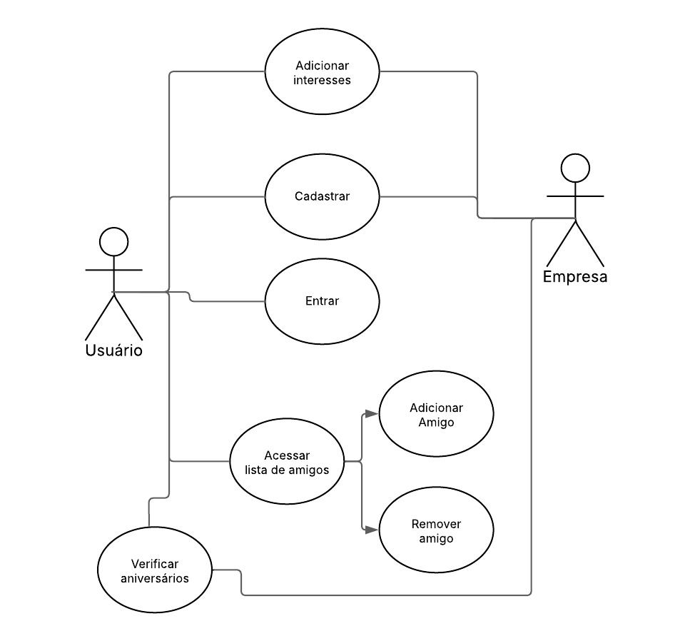
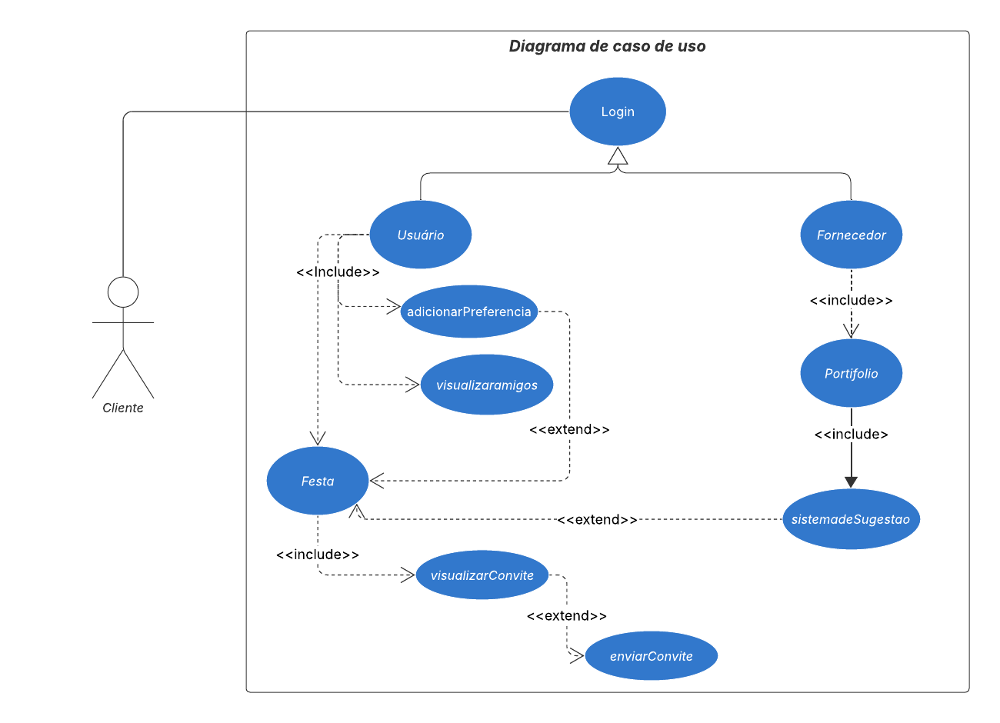

# Diagrama de casos de uso 

## Participantes

| Nome                      | 
|---------------------------|
| [Bruno de Oliveira](https://github.com/BrunoOLiveirax) |
| [Breno Fernandes Soares](https://github.com/brenofrds) | 
| [Bruno Ricardo de Menezes ](https://github.com/EhOBruno) |
| [Mayara Alves de Oliveira](https://github.com/mayara-tech) | 
| [Vinicius Castelo](https://github.com/Vini47) | 

## Introdução

O Diagrama de Caso de Uso é uma ferramenta da UML (Unified Modeling Language) utilizada para representar graficamente as funcionalidades esperadas de um sistema sob o ponto de vista dos usuários. Ele descreve as interações entre os atores (usuários ou sistemas externos) e os casos de uso (funcionalidades), permitindo uma visão clara e resumida dos serviços oferecidos pelo sistema.1

## Objetivo

O objetivo do Diagrama de Caso de Uso é apresentar, de forma simplificada e compreensível, as principais funcionalidades do sistema e como os usuários interagem com elas. Através dessa representação, é possível alinhar as expectativas dos stakeholders, garantir a cobertura dos requisitos essenciais e fornecer uma base sólida para a modelagem mais detalhada nas etapas seguintes do desenvolvimento de software.

## Metodologia

A elaboração do Diagrama de Caso de Uso foi realizada de forma colaborativa pela equipe, composta por cinco integrantes. O processo foi dividido em duas etapas principais para garantir clareza, consistência e validação das funcionalidades modeladas.

Na primeira etapa, dois membros da equipe ficaram responsáveis por desenvolver o esboço inicial do diagrama. Nessa fase, foram definidos os atores principais do sistema e os possíveis casos de uso com base nos requisitos previamente identificados.

Na segunda etapa, os outros três integrantes ficaram responsáveis pela criação do modelo definitivo, refinando as informações e organizando visualmente os elementos no padrão UML. Foram aplicadas boas práticas de modelagem para garantir que o diagrama representasse de forma precisa as funcionalidades do sistema e as interações com os usuários.

## Diagrama
O esboço apresentado na figura 1 tem como objetivo organizar as primeiras ideias sobre os casos de uso do sistema QuemFazNiver_GostaDe, servindo como base para discussões e validações iniciais.

Figura 1: Esboço diagrama de casos de uso.

Fonte: Bruno de Oliveira e Vinicius Castelo 

 

O diagrama definitivo apresentado na figura 2 representa de forma estruturada e padronizada as funcionalidades do sistema e suas interações com os atores, conforme definido pela equipe após alinhamento coletivo.

Figura 2: Diagrama de casos de uso.

Fonte: Mayara Alves, Bruno Ricardo  e Breno Fernandes 

 

O diagrama apresentado ilustra as funcionalidades principais do sistema **QuemFazNiver_GostaDe**, evidenciando os **atores envolvidos** e os **casos de uso** que representam a interação entre o sistema e seus usuários. Ele está organizado com base nas ações dos dois tipos de usuário: **Cliente (Usuário)** e **Fornecedor**.

### Atores

- **Cliente**  
  Representa o usuário que acessa o sistema para criar uma festa, configurar preferências, visualizar amigos e enviar convites.

- **Fornecedor**  
  Representa o prestador de serviços que disponibiliza informações no sistema por meio de seu portfólio.

#### Login
- Acesso inicial ao sistema.  
- É um ponto de entrada comum tanto para o **Usuário** quanto para o **Fornecedor**.

#### Usuário

- **adicionarPreferencia**  
  Permite configurar preferências relacionadas à festa.  
  _Incluído diretamente no caso de uso `Usuário`._

- **visualizaramigos**  
  Permite ao usuário ver amigos convidados ou adicionados.  
  _Extensão do caso de uso `Usuário`, pois pode ser opcional ou condicional._

- **Festa**  
  Caso de uso central do usuário.  
  _Inclui `adicionarPreferencia` e `visualizaramigos`, além de estender `sistemadeSugestao` e `visualizarConvite`._

- **visualizarConvite**  
  Permite que o usuário acesse os convites gerados.  
  _Incluído no processo da `Festa`._

- **enviarConvite**  
  Ação para disparar os convites aos participantes.  
  _Estende o caso de uso `visualizarConvite`._

### Fornecedor

- **Portfólio**  
  Caso de uso em que o fornecedor cadastra suas informações e serviços oferecidos.  
  _Incluído diretamente no papel do Fornecedor._

- **sistemadeSugestao**  
  Responsável por sugerir fornecedores aos usuários com base nas preferências.  
  _Incluído no `Portfólio` e estendido pelo caso de uso `Festa`._

### Relações UML utilizadas

- **`<<include>>`**  
  Indica que o caso de uso sempre será executado como parte de outro. 

- **`<<extend>>`**  
  Indica que o caso de uso pode ser executado opcionalmente, sob certas condições.

- **Generalização**  
  Representada por uma seta com ponta triangular, indica que um caso de uso herda o comportamento de outro.    

## Conclusão 

O diagrama de casos de uso apresentado oferece uma visão funcional do sistema QuemFazNiver_GostaDe, evidenciando as principais interações possíveis para os dois perfis de usuários: cliente e fornecedor. A estrutura demonstra que o sistema foi projetado para ser centrado na experiência do cliente, com funcionalidades que o acompanham desde o login até o envio de convites e recebimento de sugestões personalizadas de fornecedores.

Ao organizar os casos de uso com relacionamentos << include >> e << extend >>, o modelo revela uma arquitetura modular, que favorece tanto a reutilização de funcionalidades quanto a expansão de comportamentos em contextos específicos. Isso não só promove clareza no desenvolvimento como também facilita ajustes futuros na aplicação, permitindo que novas funcionalidades sejam integradas sem comprometer o núcleo do sistema.

## Bibliografia 

> FOWLER, Martin. UML essencial. 3. ed. Porto Alegre: Bookman, 2011. E-book. p.52. ISBN 9788560031382. Disponível em: https://integrada.minhabiblioteca.com.br/reader/books/9788560031382/. Acesso em: 06 mai. 2025.

## Histórico de versões

| Versão |    Data    |                       Descrição                       |                       Autor(es)                        |                      Revisor(es)                       |
| :----: | :--------: | :---------------------------------------------------: | :----------------------------------------------------: | :----------------------------------------------------: 
| `1.0`  | 07/05/2025|  Criação do esboço do diagrama de caso de uso |[Bruno de Oliveira](https://github.com/BrunoOLiveirax), [Vinicius Castelo](https://github.com/Vini47) | [Mayara Alves ](https://github.com/mayara-tech), [Bruno Ricardo de Menezes ](https://github.com/EhOBruno), [Breno Fernandes Soares](https://github.com/brenofrds) |
| `1.1`  | 08/05/2025| Criação do modelo definitivo do diagrama de comunicação |[Mayara Alves ](https://github.com/mayara-tech), [Bruno Ricardo de Menezes ](https://github.com/EhOBruno), [Breno Fernandes Soares](https://github.com/brenofrds) | [Bruno de Oliveira](https://github.com/BrunoOLiveirax), [Vinicius Castelo](https://github.com/Vini47) |
| `1.2`  | 08/05/2025|  Revisão do modelo |[Vinicius Castelo](https://github.com/Vini47)  | [Mayara Alves ](https://github.com/mayara-tech) |
| `1.3`  | 09/05/2025| Criação da página no repositório do projeto |[Mayara Alves ](https://github.com/mayara-tech)  | [Bruno Ricardo de Menezes ](https://github.com/EhOBruno) |
| `1.4`  | 09/05/2025| Adição da estrutura e dos elementos descritivos |[Mayara Alves ](https://github.com/mayara-tech), [Bruno Ricardo de Menezes ](https://github.com/EhOBruno), [Breno Fernandes Soares](https://github.com/brenofrds) | [Bruno Ricardo de Menezes ](https://github.com/EhOBruno) |
