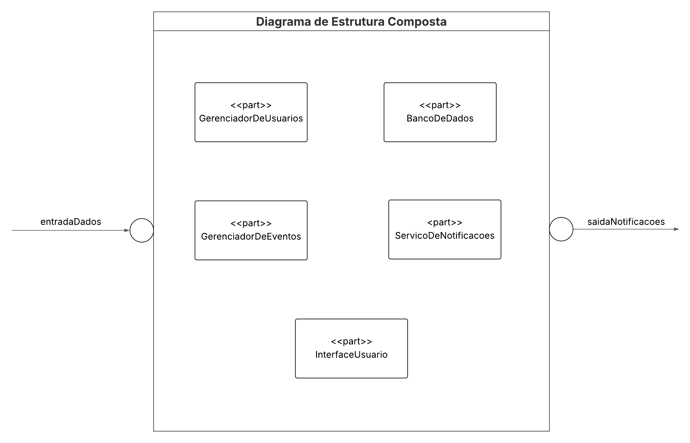

# Diagrama de estrutura composta

## Introdução

A modelagem de software é uma etapa fundamental no processo de desenvolvimento de sistemas, pois permite representar de maneira visual e organizada os principais elementos que compõem a arquitetura do sistema. Dentre as diversas ferramentas da UML (Unified Modeling Language), o Diagrama de Estrutura Composta destaca-se por oferecer uma visão detalhada da estrutura interna de uma classe ou componente, incluindo suas partes e as interações entre elas. Esse tipo de diagrama é essencial para compreender o funcionamento interno do sistema e facilitar o desenvolvimento modular.

## Objetivo

O objetivo é apresentar a estrutura interna do sistema QuemFazNiver_GostaDe por meio de um Diagrama de Estrutura Composta, destacando os principais componentes internos que compõem o sistema, suas interações e as portas de entrada e saída de dados. A intenção é contribuir para uma melhor compreensão da arquitetura do sistema e das responsabilidades de cada parte.

## Metodologia 

A metodologia adotada consistiu em uma abordagem teórica com base na literatura especializada em modelagem de software, em especial nas orientações propostas por Barbosa e Silva (2020). A partir desse referencial, foi possível compreender os elementos que compõem o Diagrama de Estrutura Composta e como aplicá-lo corretamente para representar a arquitetura interna de um sistema.

## Diagrama

O diagrama apresentado na figura 1 tem como objetivo representar visualmente a interação dos componentes internos que compõem o sistema, suas interações e as portas de entrada e saída de dados.

O diagrama apresentado na figura 1 tem como objetivo representar visualmente a interação entre os principais pontos do sistema QuemFazNiver_GostaDe.

Figura 1: diagrama de estrutura composta.

Fonte: Mayara Alves  

  
 
A Figura 1 apresenta o Diagrama de Estrutura Composta do sistema, que representa a estrutura interna do projeto QuemFazNiver_GostaDe. No centro, temos o componente principal, que engloba os seguintes elementos internos:

**`GerenciadorDeUsuarios:**` responsável por autenticar e manter o cadastro dos usuários.

**`GerenciadorDeEventos:**` encarregado da criação e controle dos eventos de aniversário.

**`ServicoDeNotificações:**` módulo que envia alertas e lembretes aos participantes.

**`BancoDeDados:**` responsável por armazenar todas as informações persistentes do sistema.

**`InterfaceUsuario:**` ponto de interação entre o usuário final e o sistema.

As portas **`entradaDados**` e **`saidaNotificações**` representam, respectivamente, os pontos de entrada de informações no sistema e de saída para envio de notificações externas.

## Conclusão

A representação da estrutura interna do sistema por meio do Diagrama de Estrutura Composta foi essencial para detalhar como os componentes se integram e interagem. Esse tipo de modelagem favorece a compreensão da arquitetura do sistema e facilita tanto a manutenção quanto futuras expansões. A aplicação da UML neste contexto mostra-se eficiente para comunicar ideias técnicas de forma visual e padronizada.

## Bibliografia

> BARBOSA, Simone; SILVA, Bruno. Engenharia de Software com UML. São Paulo: Novatec, 2020. Acesso em: 06/05/2025

## Histórico de versões

| Versão |    Data    |                       Descrição                       |                       Autor(es)                        |                      Revisor(es)                       |
| :----: | :--------: | :---------------------------------------------------: | :----------------------------------------------------: | :----------------------------------------------------: 
| `1.0`  | 08/05/2025| Criação do esboço do diagrama de estrutura composta |[Mayara Alves ](https://github.com/mayara-tech)| [Bruno Ricardo de Menezes ](https://github.com/EhOBruno), [Breno Fernandes Soares](https://github.com/brenofrds) |
| `1.1`  | 09/05/2025| Criação do modelo definitivo do diagrama de estrutura composta |[Mayara Alves ](https://github.com/mayara-tech)| [Letícia Resende](https://github.com/LeticiaResende23)   |
| `1.2`  | 09/05/2025| Criação da página no repositório do projeto  |[Mayara Alves ](https://github.com/mayara-tech)| [Letícia Resende](https://github.com/LeticiaResende23)   |
| `1.3`  | 09/05/2025| Adição da estrutura e dos elementos descritivos |[Mayara Alves ](https://github.com/mayara-tech)| [Letícia Resende](https://github.com/LeticiaResende23)   |
| `1.4`  | 09/05/2025| Adição da diagramas |[Bruno de Oliveira ](https://github.com/BrunoOLiveirax)| [Letícia Resende](https://github.com/LeticiaResende23)   |